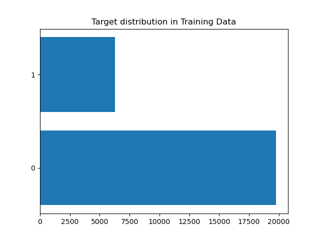

# Model Card

For additional information see the Model Card paper: https://arxiv.org/pdf/1810.03993.pdf

## Model Details
This is a Random Forest model developed in python using scikit-learn with the default parameters.  
This model aims to clasify whether an individual has an income of over $50,000 based on various demographic features.  
This model is trained on the UCI Census Income Dataset

## Intended Use
This model is only intented to use for educational purposes as an example of how to deploy a machine learning in 
production

## Training Data
We split data in train and test set.  
Train dataset has 26048 rows and this plot show the distribution in target variable. We can see that we have an 
imbalance dataset

## Evaluation Data
Test dataset has 6513 rows and this plot show the distribution in target variable

## Metrics
To evalute this model we use the following metrics: precision, recall and fbeta.
We got the following results in test dataset:

| Metric    | Value   |
|-----------|---------|
| Precision | 0.74227 |
| Recall    | 0.62698 |
| Fbeta     | 0.67977 |

## Ethical Considerations
We risk expressing the viewpoint that the attributes in this dataset are the only ones that are predictive of someone's
income, even tough we know this is not the case

## Caveats and Recommendations
We surely can improve model performance using other methods to preprocess categorical and numeric features and also 
trying other kind of clasification algoritms like more advanced boosted tree based algoritms like lightgbm or catboost.  
Also we could try some technique to deal with imbalance dataset like this.